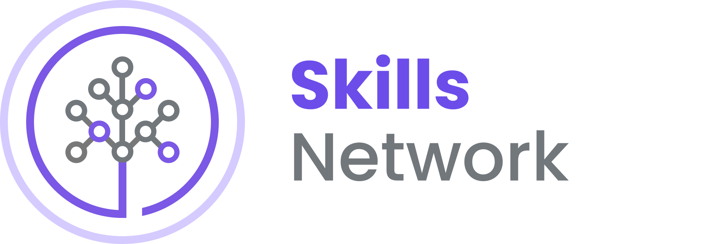

# Getting Started with Node.js

Node.js is the environment of choice for many industries, including IT and healthcare, and is used by developers to build fast, scalable network applications. If you know JavaScript, you can build both front-end and back-end applications using Node.js. In this hands-on guided project, you will learn how to develop both front end and back end with JavaScript, practice front-end styling with CSS and HTML, and learn how to use npm, a JavaScript package manager.

By the end of this guided project, you will have a foundation for full-stack application development.

You’ll have access to a Cloud-based IDE that has all of the required software, including Node.js, pre-installed.

## What You’ll Learn

- Run a simple Node.js app on your localhost
- Use npm to install packages
- Add styling to your app using HTML and CSS

## What You’ll Need

Just a modern web browser.

Okay, you are ready to start!
