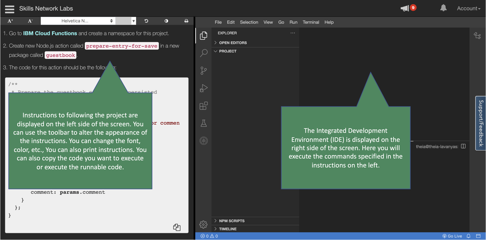
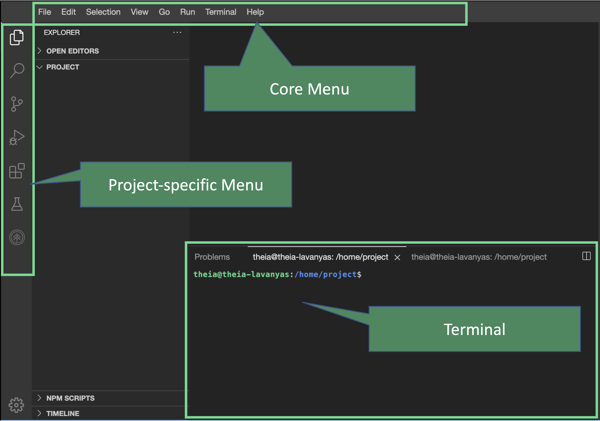

# Getting Familiar with Your Lab Environment

In case you are having issues viewing the instructions below or prefer to view the instructions in a new browser tab, click here.

Get Familiar with Your Lab Environment

You will be using Cloud IDE (Interactive Development Environment) to do this project. The Cloud IDE is a great way to do projects without downloading, installing, configuring, and integrating software on your own computer. Instead, you do everything in a web browser.

Your Labs Cloud IDE has two major components:

1. **Instructions** you will be following to do this project
2. **Integrated Development Environment** (IDE) where you will use the terminal, write code, and do all other tasks you typically do in an IDE:
3. Labs with instructions on the left and Cloud IDE on the right

Suppose you have used Integrated Development Environments (IDE) like Visual Studio Code (VS Code) you will be instantly familiar with the Cloud IDE that has been provided to you. You will be using the terminal most often but you will have access to all other functions of the IDE. You can open a terminal session from the core menu when your project launches. Go to `Terminal > New Terminal` to open a terminal.

Next steps

Next, you will launch your project in Cloud IDE. Cloud IDE will launch in a separate browser tab
