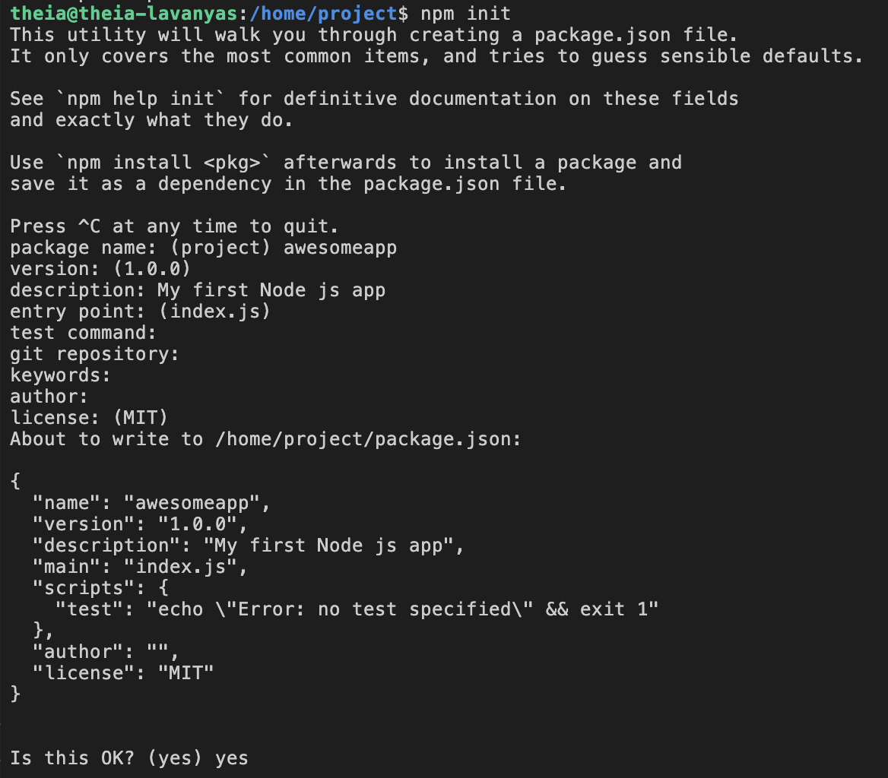

# The Set Up

1. Node.js and NPM should already be installed in your Cloud IDE. We already know what Node.js is, but what is NPM? NPM is your package manager, it will handle all your packages and frameworks that you need in your project. To import a package, you can run npm install <package name>.

2. Let’s run some command to get started. First, run the following command in the terminal:

    ```bash
    npm init
    ```

    This command will initialize your project, prompting you to input some metadata about your project such as the name of the project, description, author, etc. To leave it as default or empty, just press ENTER. The most important field is the `entry point` which has to match your root JavaScript file. Keep it as default, `index.js`. We will be creating this file later.

    >***NOTE:** Once you’ve finished, `package.json` should be created.*

    Every Node Package has package.json. It holds all the metedata of the project. It’s like the ID of the project. For more:  
    <https://nodejs.org/en/knowledge/getting-started/npm/what-is-the-file-package-json/>

    

3. Let’s install Express using npm. Run:

    ```bash
    npm install express
    ```

    Express is a good example of a package that wouldn’t be possible without Node.js allowing JavaScript to run on a server. Express provides an easy way to set up integral parts of webapps like routing and handling HTTP requests.

    This should have created `package-lock.json` and `node_modules` directory. Now, we can now use Express in our application!

    > *All packages installed by npm will be inside `node_modules` directory. You will be able to find a `express` directory inside `node_modules` which has been just installed. You can see how each package is its own project and we are literally importing the code to be re-used for our project.*
