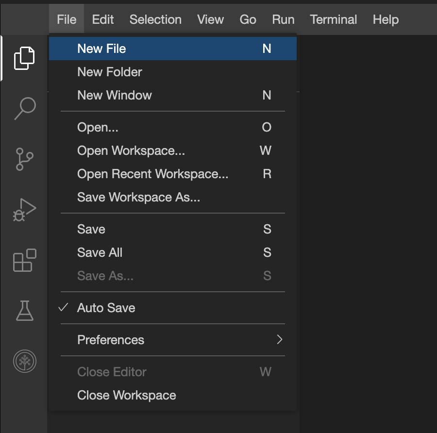
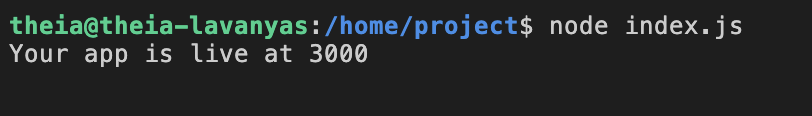
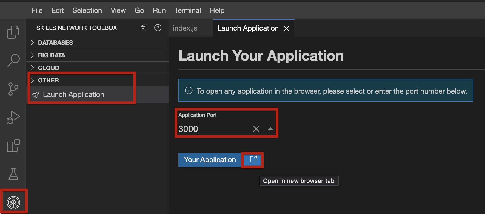
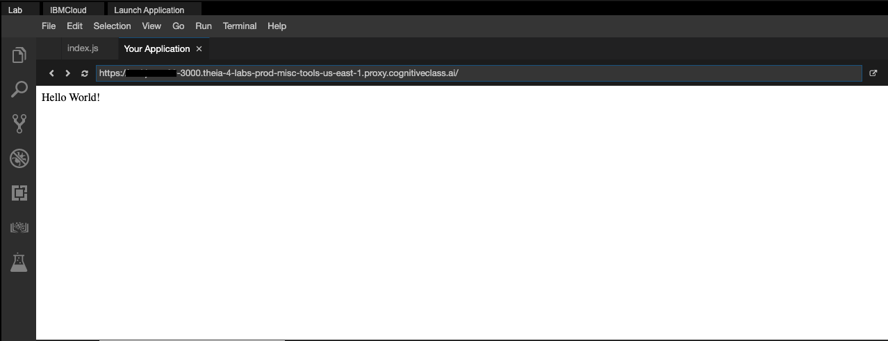

# Let's write some JavaScript

1. In Cloud IDE, select `File > New File` as seen below.

    

2. Choose a name for the file. In our case, we will name it `index.js` to match the “Entry Point” In our package.json.

3. In the file, copy and paste the code below. This code will create a web app running on our localhost and will say “Hello World”.

    ```js

    const express = require('express')
    const app = express()
    const port = 3000
    app.get('/', (req, res) => {
      res.send('Hello World!')
    })
    app.listen(port, () => {
      console.log(`Your app is live at ${port}`)
    })
    ```

4. Let’s understand what we’ve written.

    On the first line, we are importing the framework into our code that we’ve previously installed using npm. Express makes it really easy to start the server. On line 5, we are declaring how our server will respond to `/` route. Here we are just returning text ‘Hello World!’.

5. Let’s run the code! Inside Node.js, you can run a JavaScript file by running `node <file name>`. In the terminal run the following to run `index.js`:

    ```bash
    node index.js`
    ```

    Your output should be similar to the following:

    

    Click on the `Launch My Application` button below or navigate to the Skills Network Extension and select “OTHER”. Click “Launch Application”. Under “Application Port”, type in the port number. In this case, it is 3000. Press “Your Application”.

    

    Your app should be able to see your app!

    

6. When you are done, go to your terminal and `CTRL-C` to stop the app.
