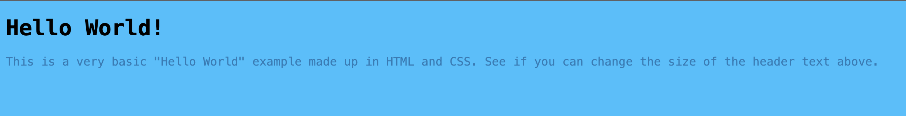

# Add Some Style

Currently, our app is too plain. Let’s add some style to this page.

We are going to use

1. Create a new folder (`File > New Folder`) and name it views. Inside, create a new file and name it `helloworld.html`. It’s good practice to create folders for different purposes. It is general convention to name the folder `views` and store all html files.

2. Let’s copy the following HTML code to `helloworld.html`.

    ```html
    <!DOCTYPE html>
    <head>
        <title>HTML and CSS "Hello World"</title>
        <style>
            body {
                background-color: #2dc0ff;
            }
            h1 {
                color: black;
                font-size: 30px;
                font-family: Menlo, Monaco, fixed-width;
            }
            p {
                color: rgb(27, 124, 184);
                font-family: "Source Code Pro", Menlo, Monaco, fixed-width;
            }
        </style>
    </head>
    <body>
        <h1>Hello World!</h1>
        <p>This is a very basic "Hello World" example made up in HTML and CSS. See if you can change the size of the header text above.</p>
    </body>
    </html>
    ```

    This is a typical HTML code block. HTML are built of tags. Tags start with `<>` and `</>`. For example, header tag goes `<h1>` and ends with `</h1>`. Let’s go through each tag one by one.

    Every HTML file starts with `<!DOCTYPE html>`, not sure why let’s move on to the `<head>` tag. The `<head>` is where all your metadata goes, like the title, and the style. This title will be shown on the browser’s title bar or the tab bar. The style allows you style certain tags. For example, we see that we set the `<body>`‘s background colour to be #2dc0ff.

    After the `<head>` tag, there is a `<body>` tag and this is where you define the page itself. You will see various tags like `<h1>`, `<p>`, `<li>` and these each have there own purpose to them.

3. Now let’s change `index.js` such that it will render the HTML.

   - a. We are going to import `path` library. Add the following to the top of the code. `Path` makes it really easy to interact and access different files in the project.

        ```js
        const path = require('path');
        ```

   - b. Change line 6 to render the file instead.

        ```js
        // Before
        res.send('Hello World!')
        // After
        res.sendFile(path.join(__dirname, 'views/helloworld.html'));
        ```

   - c. Start the app again and see the changes. It should look something similar to this:

    

   - d. Now, add your own style and features to this web app! (Optional)
