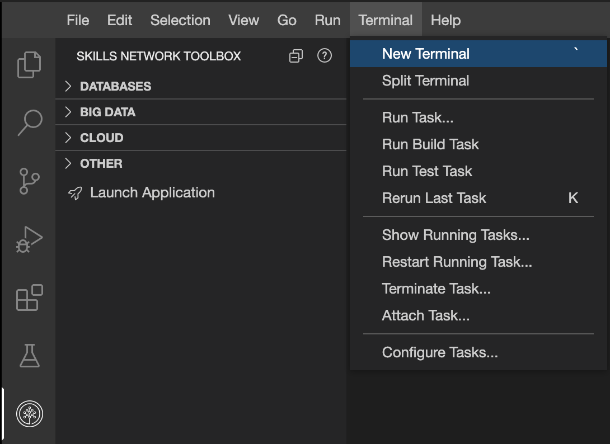
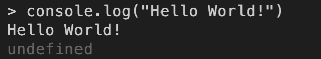
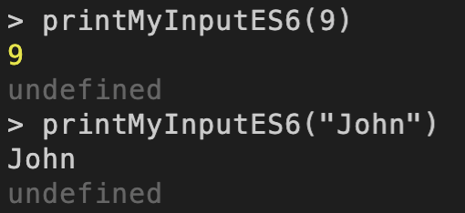

# Hands-on lab on Node JS


The purpose of this lab is to brush up on Node.js framework before you set off doing server side coding with Node JS. This lab presumes that you have completed the IBM HTML CSS and JS for Web development. All the tasks in this lab are intended to reinforce what you have already learnt.

**Duration (15 mins)**

### Objective

After completing this lab you will be able to:

1. Run Node JS commands in the terminal
2. Write Node JS applications

## Task 1 - Running Node JS commands

To run the commands we will use the terminal. Type or paste the command and press **enter** to run the command.

1. Open a new terminal

    

2. Run the following command to open the node prompt

    ```bash
    node
    ```

3. Let’s start with a simple code to print **Hello World!** to the console. Run the following command.

    ```js
    console.log("Hello World!")
    ```

    >*The output will be as in the image below. Since console.log does not return anything to the function, ‘undefined’ is returned by default*  
    

4. Let’s create some variable and print them. Run the following command.

    ```js
    let num = 5
    var mystr = "John"
    console.log(num)
    console.log(mystr)
    ```

    >*Both let and var can be used to create variables. `var` is used when you want the variable to have global scope and `let` is used when you want the variable to have scope within the block where it is created.*

5. Let’s create a constant and print it. Run the following command.

    ```js
    const pi_val = 3.147
    console.log(pi_val)
    ```

    >Const is used to declare variable whose values can never change

6. Let’s create function which prints any value that is input to it.

    ```js
    function printMyInput(user_input) {
        console.log("The parameter passed is "+user_input)
    }
    ```

7. Call the function you created in the previous step once with a number and once with a string.

    ```js
    printMyInput(9)
    printMyInput("John")
    ```

8. Let’s rewrite the function printMyInput according to the ES6 standard. This syntax is also called `arrow functions` and provide a shorthand to write functions.

    ```js
    let printMyInputES6 = (user_input)=>{
        console.log(user_input)
    }
    ```

9. Call the function you created in the previous step once with a number and once with a string.

    ```js
    printMyInputES6(9)
    printMyInputES6("John")
    ```

    >*Since the function is passed a single value and the body of the function is a single line, the brackets can be omitted. The code can also be written as below.*

    ```js
    let printMyInputES6Short = user_input => console.log(user_input)
    ```

    Now when we call it, the output should remain the same.

    ```js
    printMyInputES6(9)
    printMyInputES6("John")
    ```

    

    Press Ctrl+D to exit the prompt.
