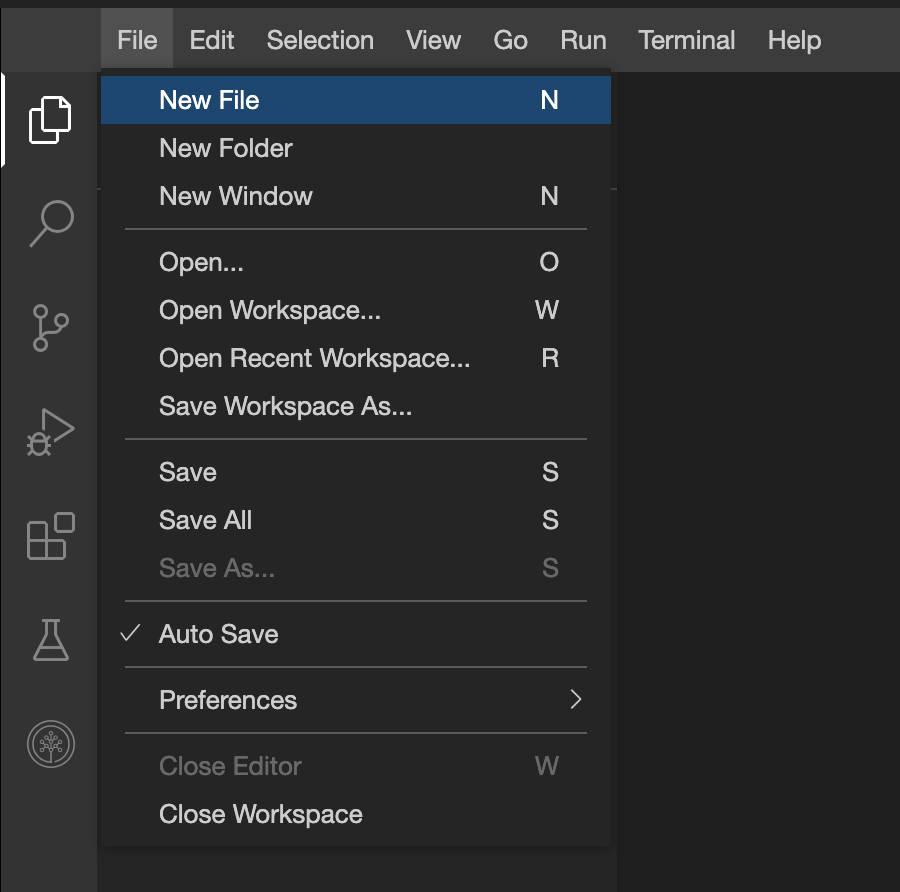
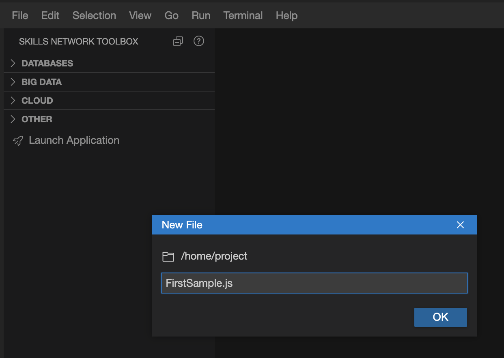

# Task 2 - Writing JS file

1. At the command prompt, in the terminal window, run the following command to install a node package called `prompt-sync`.

    ```bash
    npm install -s prompt-sync
    ```
    >*`npm install` command installs the packages that are not available by default. Once installed these packages can be imported in the code. In the code sample above, installs the latest version of the package prompt-syn in silent mode (-s).*
    ```

2. Create a new file named FirstSample.js

    

    

3. Paste the following code and save the file.

    ```js
        //require the  package to be used in the code and assign it to a variable name
        const prompt = require("prompt-sync")();
        //Create an ES6 arrow function that prints any parameter that is passed
        let printMyInput = (user_input) => {
            console.log("The parameter passed is "+user_input)
        }
        let user_input = prompt("Enter some string or number: ");
        //Call the method passing the user_input as parameter
        printMyInput(user_input)
    ```

4. Run the code. Enter a string when prompted and observe the output.

    ```js
    node FirstSample.js
    ```
