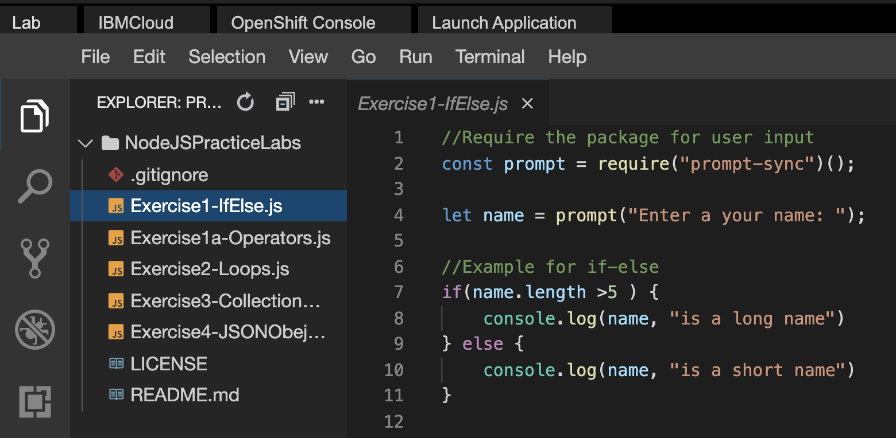

# Task 3 - Operators, Controls, Loops

In this task you will be running some javascripts from which you can learn how to use operators, controls and loops. After cloning you can view the code on the file explorer.  



>*Ensure that you understand the code in each file. These are primitive and foundational for your understanding of Node JS*

1. Clone the remote repository.

    ```bash
    git clone https://github.com/ibm-developer-skills-network/NodeJSPracticeLabs.git
    ```

2. Change to the exercise directory.

    ```bash
    cd NodeJSPracticeLabs
    ```

3. View and run Exercise1-IfElse.js. This is focused on `if-else`, `if-else if-else` and `switch-cas`e.

    ```bash
    node Exercise1-IfElse.js
    ```
